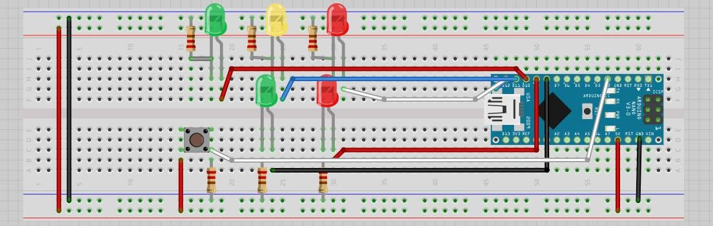

# ReporteSemaforo
SEMAFORO INTERACTIVO:
Simular la interacción de la funcionalidad de un semáforo que regula el tráfico de vehículos donde, la luz verde indica cuando los vehículos deben cruzar, la luz amarilla indica que los vehículos deben disminuir la velocidad para detenerse y la luz roja indica a los vehículos que debe estar en altura total.
La secuenciación de las luces se basa en el sistema del Reino Unido, donde primero va de verde a amarillo y luego a rojo, después de un cierto tiempo, la luz roja va al amarillo y finalmente a verde, donde los vehículos pueden circular de nuevo.
Por otro lado, también el programa simula un semáforo peatonal, donde la luz verde indica al peatón que puede cruzar la calle y la luz roja que espera a que los vehículos se detengan. Cuando la luz roja de los semáforos de los vehículos es verde, el semáforo en rojo del semáforo de los peatones debe estar en rojo, y cuando el semáforo de los vehículos es rojo, la luz verde del semáforo peatonal debe estar encendida.

